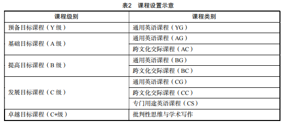
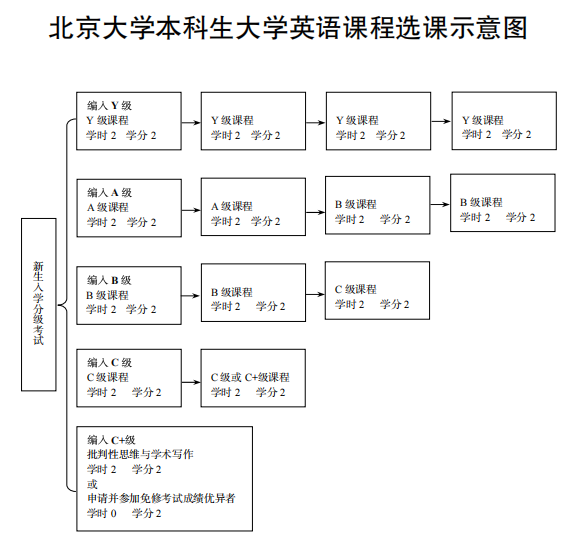

##### 修读要求

1. 所有新生（英语专业学生和留学生除外）入学后需参加大学英语分级考试，根据考试成绩编入 Y 级、A 级、B 级、C 级和 C+级，分别对应 8 学分、8 学分、6 学分、4 学分和 2 学分的“公共必修课”大学英语课程学分要求，按编入级别修读相应模块的课程。

 2.未参加分级考试的学生，统一编入 A 级。编入 C+级的学生：①可自愿申请免修大学英语课程：需参加免修考试，成绩优异者免修大学英语课程，并获 2 学  分；②可自愿申请转入 C 级修读 4 学分：需在分级后两周内提出书面申请。

 3.原则上每位学生每学期修读一门大学英语课程；在入学后三年内（含暑期学校）修完大学英语课程学分。

 4.大学英语教研室开设的暑期课程属于大学英语必修课程。

#### 课程设置

  		大学英语课程体系分五个级别，包括预备目标课程（Y 级）、基础目标课程（A 级）、提高目标课程（B 级）、发展目标课程（C 级）和卓越目标课程（C+级）；采用知识与能力目标可选、课程可选的弹性必修学分制和模块化教学方案，充分体现差异化、个性化，满足学生不同的专业和个人发展需要。预备目标课程涉及一个课程类别：通用英语课程（YG）；基础目标课程涉及两个课程类别：通用英语课程（AG）和跨文化交际课程（AC）；提高目标课程涉及两个课程类别：通用英语课程（BG）和跨文化交际课程（BC）；发展目标课程涉及三个课程类别：通用英语课程（CG）、跨文化交际课程（CC）和专门用途英语课程（CS）；卓越目标课程只涉及一门课程（批判性思维与学术写作）。

##### 考核与成绩评定 

1. 大学英语课程考核与成绩评定按照《北京大学本科生学籍管理办法》和《北京大学本科考试工作与学习纪律管理规定》的有关规定执行。

2. 大学英语课程成绩依据学生的出勤情况、课堂表现、平时作业、阶段测验、期中和期末考试成绩等综合评定。

3. 学生如因病假、事假、外出实习等原因不能按时参加期末考试，需按照《北京大学本科生学籍管理办法》规定的程序提前办理请假缓考手续。凡未办理缓考手续者按缺考处理。本方案经北京大学教务部批准，自 2024 级北京大学本科生开始执行，由北京大学外国语学院英语系大学英语教研室负责解释。

   
